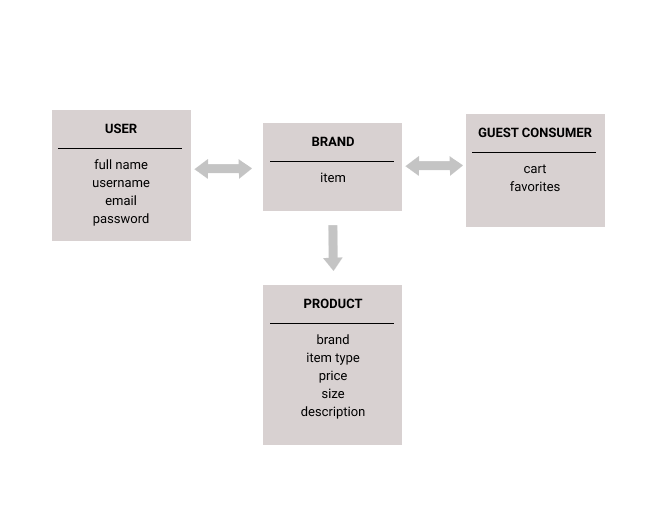

# #TRENDING  

## Wireframes
---

## User Stories

-Users are greeted with a splash page with branding id;
-Upon loading the site, users may login or register a new account.
-Items available can be sorted by various prompts: browseall, by   brand, etc.
-Items selected are added to a cart, which can be viewed with each item's properties listed. 
-Dollar amounts are added together and a total is presented. 
-User can choose to keep shopping and return to the store.
-User clicks purchase and a congrats on your purchase screen is displayed. 

---
GENERAL:
- wireframe home, cart, favorites, shopping page, payment page
- set up variables, routes, server listener, exports, middleware, database
- set up partial (navigation bar)
- create view template for all
- write a server route for all

LOGO:
- clicking on logo will lead back to home page

HOME PAGE:
- root route
- logo and app name
- slogan of our app
- include navigation 
    - SHOP BY: all, brand, type, item
    - create account

SHOPPING PAGE:
- include navigation bar

CART:
- edit/delete options
- continue shopping route (leads back to shopping page)
- continue to checkout option

CHECKOUT/PAYMENT:
- "congrats on your purchase"
- no payment info needed!

FAVORITES:
- similar to cart - a collection of favotited

USERS:
- login/registration

## DB Models and ERD
---
### ERD:

### MODELS:
- clothing
- users

### SCHEMA ATTRIBUTES:
USER:
- full name: String,
- username: String,
- email: String,
- password: String

BRAND:
- item: collection

GUEST CONSUMER:
- cart: collection,
- favorites: collection,

PRODUCT:
- brand: String,
- item type: String,
- price: Integer,
- size: String,
- description: String

## Technologies Used
---
- HTML
- CSS
- MongoDB
- Express
- JavaScript
- DOM Manipulation
- jQuery/Vanilla JS

## BONUS/PLANNED FEATURES:
- better CSS
### CRUD
- hardwire from backend 
    - not available for users
    - only available for admin (specific admin email to trigger login to create/edit route)

