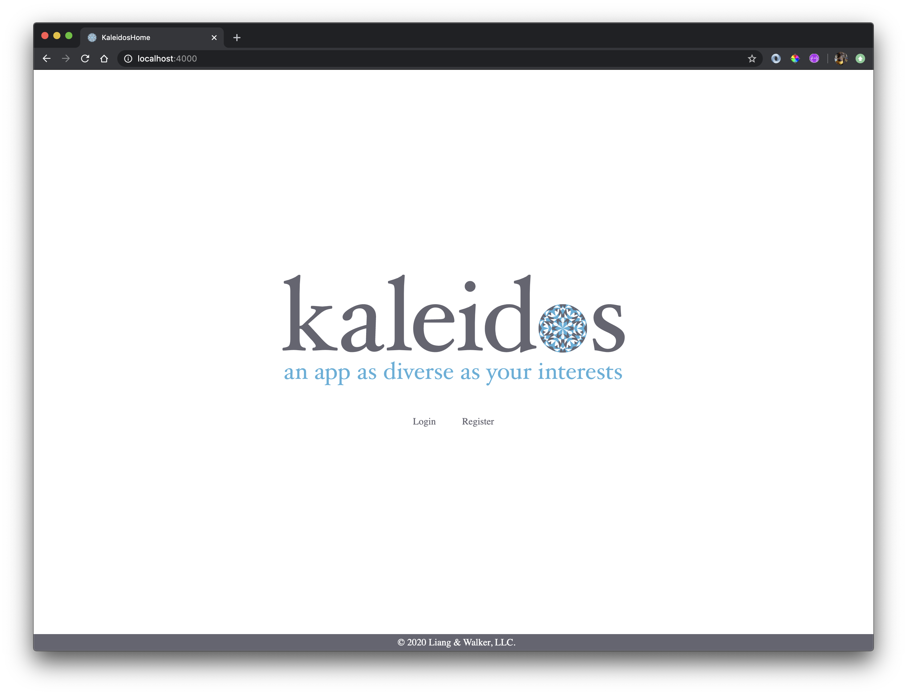
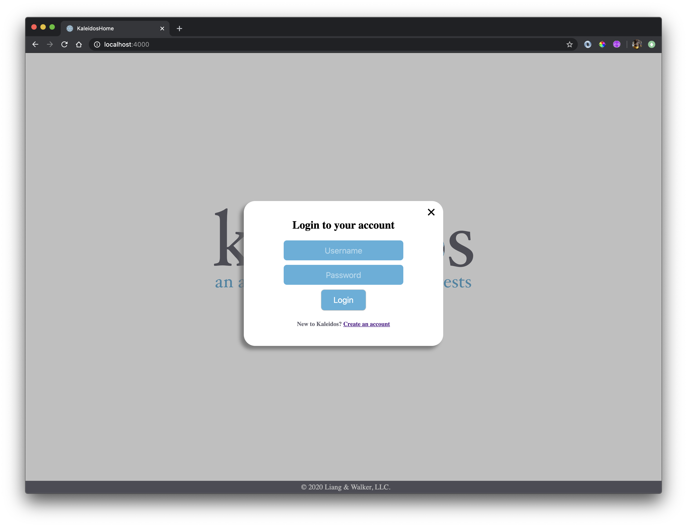
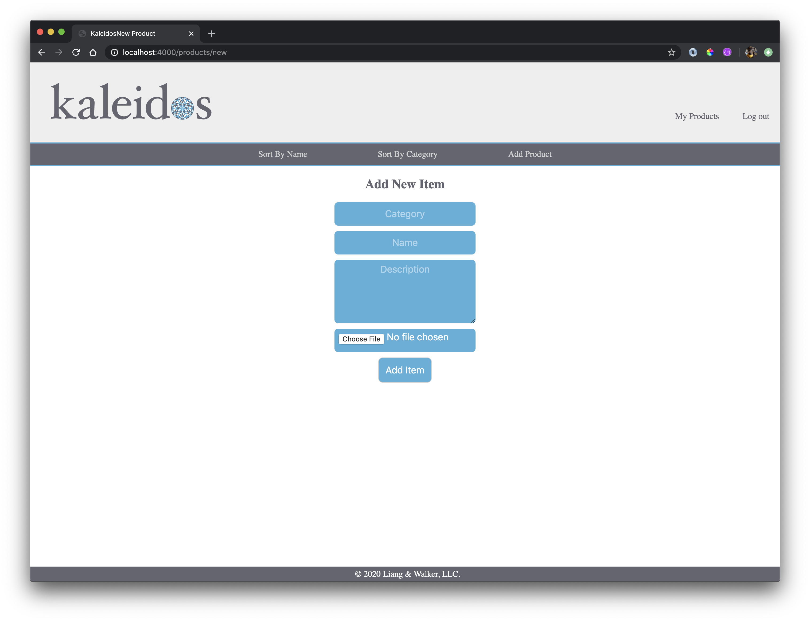
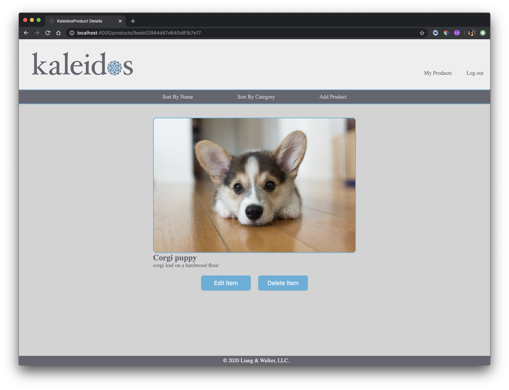
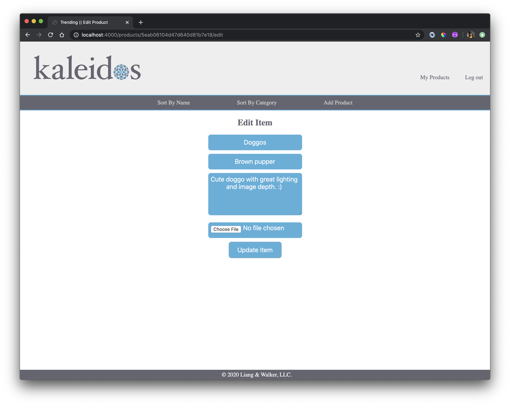
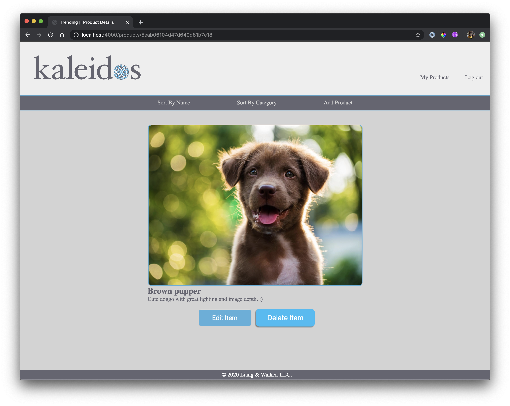
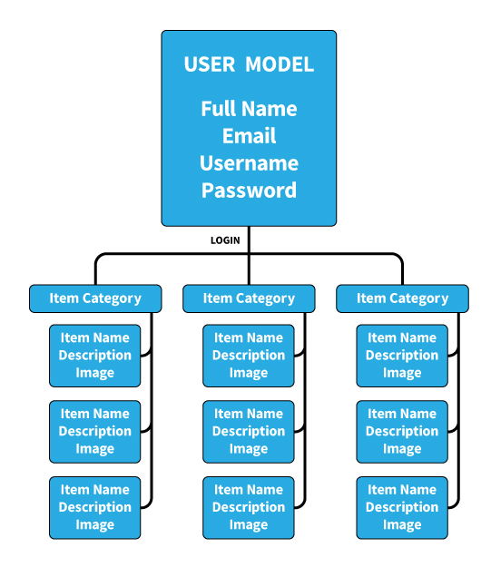

# #TRENDING  

## Wireframes
---

## User Stories

-Users are greeted with a splash page with branding id;
-Before loading the site, users may login or register a new account.
-Users can add images and descriptions of virtually anything.
-Once added, items added can be edited or deleted.
-1 user may have numerous collections of items, which can be sorted by category. 

---

LOGO:
- clicking on logo will lead back to home page

HOME PAGE:
- root route
- logo and app name
- slogan of our app
- include navigation 
    - BROWSE BY: all, category, type
    - create account

USERS:
- login/registration
- session tied to login
- logout

## DB Models and ERD
---
### ERD:

### MODELS:
- clothing
- users

### SCHEMA ATTRIBUTES:
USER:
- full name: String,
- username: String,
- email: String,
- password: String

PRODUCT:
- Category: String,
- Item name: String,
- description: String,
- image: data

## Technologies Used
---
- HTML
- CSS
- MongoDB
- Express
- JavaScript
- DOM Manipulation
- jQuery/Vanilla JS
- Session
- Mongo-Connect
- Dropzone
- Multiparty
- Cloudinary
- Dotenv

## BONUS/PLANNED FEATURES:
- better CSS

### CRUD
- full CRUD functionality for all users. 
