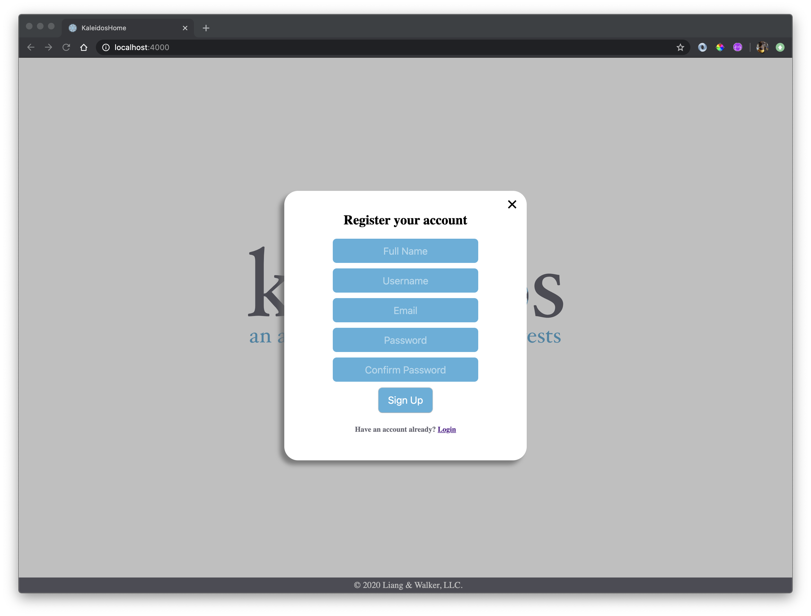
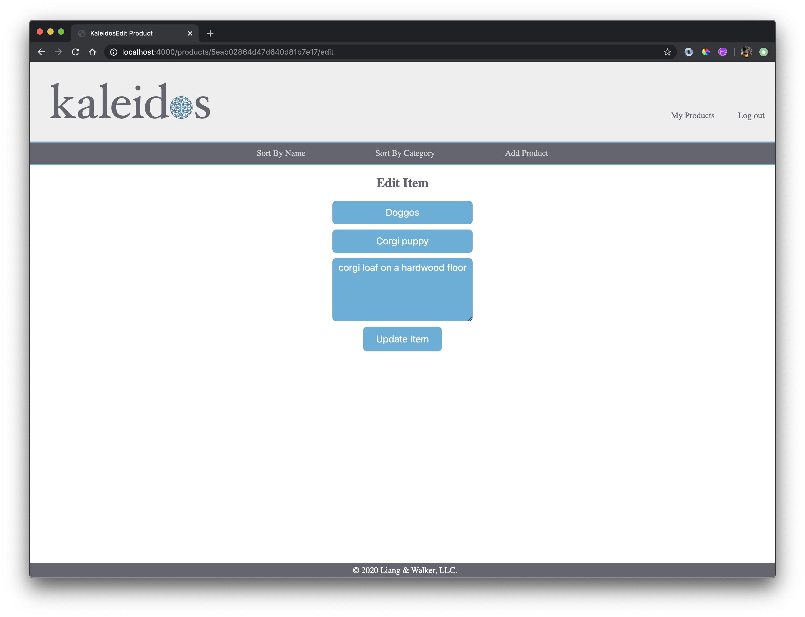

# Kaleidos 

## Wireframes

## User Stories

-   Users are greeted with a splash page with branding id;
-   Before loading the site, users may login or register a new account.
-   Users can add images and descriptions of virtually anything.
-   Once added, items added can be edited or deleted.
-   1 user may have numerous collections of items, which can be sorted by category. 

---

LOGO:
- clicking on logo will lead back to home page

SPLASH PAGE:
- root route
- logo and app name
- slogan of our app
- create account

INDEX PAGE:
- include navigation 
    - *browse by*: all, category, type

USERS:
- login/registration
- session tied to login
- logout

## DB Models and ERD
### ERD:

### MODELS:
- collection / products
- users

### SCHEMA ATTRIBUTES:
USER:
- full name: String,
- username: String,
- email: String,
- password: String

PRODUCT:
- Category: String,
- Item name: String,
- description: String,
- image: data

## Technologies Used
- HTML
- CSS
- MongoDB
- Express
- JavaScript
- DOM Manipulation
- jQuery/Vanilla JS
- Session
- Mongo-Connect
- Multiparty
- Cloudinary
- Dotenv

## BONUS/PLANNED FEATURES:
- add sort by category function
- login / registration options
- display and add images

## CRUD
- full functionality for all users
- Create new items
- View created items
- Edit items
- Delete items 
